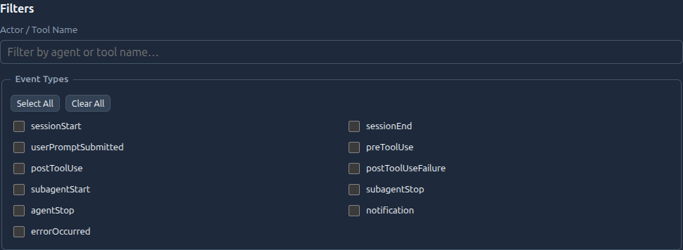

# Part 5: The Emit Pattern

Prev: [Part 4](part-4.md) | Up: [From Vanilla to Visualizer (PowerShell)](../from-vanilla-to-visualizer-ps1.md) | Next: [Part 6](part-6.md)


### Architecture: emit and forget

The vanilla approach writes directly to a log file. The visualizer separates
**capture** from **delivery**:

```
Hook script → emit-event.ps1 → emit-event-cli.ts → { JSONL file + HTTP POST }
```

1. **Hook script** extracts fields and builds the payload
2. **`emit-event.ps1`** is a thin PowerShell wrapper that calls the TypeScript emitter
3. **`emit-event-cli.ts`** validates, wraps in envelope, redacts secrets, then:
   - **Always:** appends to `.visualizer/logs/events.jsonl`
   - **Optionally:** POSTs to `http://127.0.0.1:7070/events` (the ingest service)

### JSONL is the source of truth

The JSONL file is append-only and always written. HTTP delivery is best-effort:

```typescript
// packages/hook-emitter/src/index.ts (simplified)
// 1. Always write to JSONL
await fs.appendFile(jsonlPath, JSON.stringify(event) + "\n");

// 2. Optionally POST to HTTP (swallow errors)
try {
  await fetch(httpEndpoint, { method: "POST", body: JSON.stringify(event) });
} catch {
  // Silently swallow — event is already persisted in JSONL
}
```

If the ingest service is down, events pile up in the JSONL file. When it comes
back, you can replay them:

```powershell
npm run replay:jsonl -- /path/to/events.jsonl
```

The live pairing breakdown is visible in the web UI's **Tool Pairing** bar, so
you can see how much of your session is exact-matched versus heuristic-matched
at a glance.


In the screenshot above, the hover tooltip explains why `by ID` is the
highest-confidence match class: both tool lifecycle events carried the same
`toolCallId`, so ingest did not need to fall back to `spanId` or FIFO pairing.

### Redaction

Before writing to JSONL, the emitter runs a redaction pass that strips:

- API keys and tokens → `[REDACTED]`
- Patterns matching common secret formats
- Prompt bodies (opt-in only — off by default)

The golden rule: **the default must be safe.** Operators opt *in* to storing
sensitive data, never opt *out*.

### What changed from vanilla

```diff
 # Vanilla: one line, direct to file
-Add-Content -Path .github/hooks/logs/events.jsonl -Value $inputJson
+
+# Enhanced: validate -> redact -> JSONL + optional HTTP
+.visualizer\emit-event.ps1 -EventType preToolUse -Payload $payloadJson -SessionId $SessionId
```

In PowerShell hooks, use `try/catch` around emits (or tolerate non-fatal
emit failures) so hook telemetry issues don't crash the host process.

### Try it yourself

1. Stop the ingest service (or point to a non-listening endpoint).
2. Run a session that emits several events.
3. Confirm events still append to `.visualizer/logs/events.jsonl`.
4. Restart the ingest path and run `npm run replay:jsonl -- /path/to/events.jsonl`.
5. Verify replay restores events downstream.

Reliable way to simulate HTTP down while preserving JSONL writes:

```powershell
$SessionId = "offline-" + [int](Get-Date -UFormat %s)
$env:VISUALIZER_HTTP_ENDPOINT = "http://127.0.0.1:9999/events"
.visualizer\emit-event.ps1 -EventType sessionStart -Payload '{}' -SessionId $SessionId
Remove-Item Env:VISUALIZER_HTTP_ENDPOINT
```

Verify the event was still persisted locally:

```powershell
Get-Content .visualizer/logs/events.jsonl -Tail 30 |
  ForEach-Object { $_ | ConvertFrom-Json } |
  Where-Object { $_.sessionId -eq $SessionId } |
  Select-Object -ExpandProperty eventType
```

If you run the web UI alongside this step, the filter controls make it easy to
isolate just the replayed event classes or one actor/tool at a time.



---

Prev: [Part 4](part-4.md) | Up: [From Vanilla to Visualizer (PowerShell)](../from-vanilla-to-visualizer-ps1.md) | Next: [Part 6](part-6.md)
